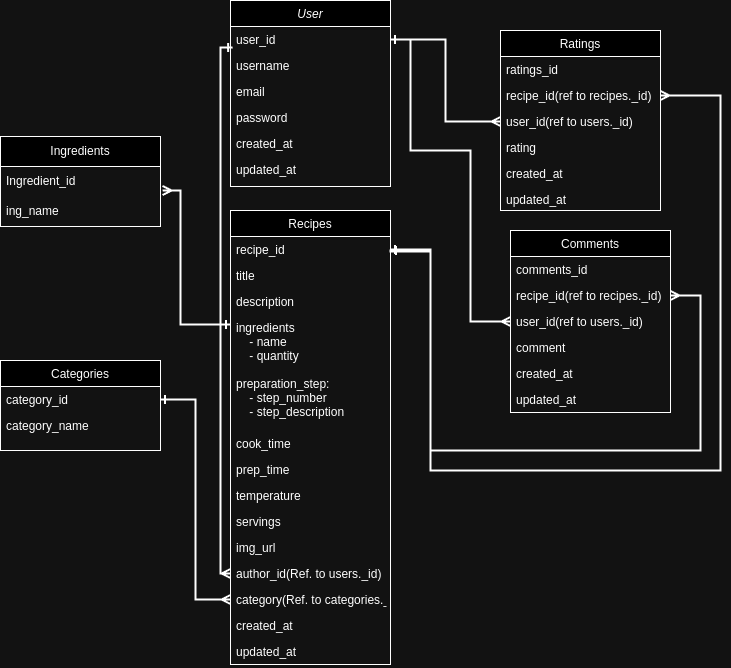

# AiryBites Recipes

## Introduction
Welcome to AiryBites Recipes, my Milestone Project 3 for the Level 5 Diploma in Full Stack Web Application Development! This project will showcase my skills in full-stack web development by creating a dynamic and user-friendly recipe sharing application.

### Project Overview
AiryBites Recipes will enable users to create, share, and discover a variety of recipes. Users will be able to:

- Sign up and log in to their accounts
- Add new recipes with details like ingredients, preparation steps, and images
- Edit and delete their own recipes
- Browse and search for recipes shared by other users
- Interact with the community through comments and ratings
Through this project, I aim to demonstrate my ability to integrate various technologies into a cohesive and functional application, ensuring a smooth and engaging user experience.

## Deployed App : https://airybites-app-9649332aa316.herokuapp.com/

## List Of Features

### Navigation

- **Navigation Bar:** Provides easy access to other sections of the website with clear and responsive navigation links.

- **Side Navigation:** Provides a collapsible side navigation menu for easy access to various sections of the website.

- **Admin Navigation:** Provides a navigation bar specifically tailored for administrative tasks.

### Home Page

- **Hero Image:** Features a visually appealing hero image with overlay and text, welcoming users to the site.

- **Recipe Browsing Section:**
    - **Recipe List**
        - An introductory heading encouraging users to browse recipes.
        - Recipes are displayed in a collapsible list for easy navigation.
        - Each recipe item includes a header with the recipe title, category, and options to edit or delete if created by the logged-in user.

    - **Recipe Details:**
        - Each recipe includes detailed information such as description, timers, ingredients, and instructions.
        - Additional metadata like the creator's name and timestamps are also provided.

- **Delete Confirmation Modal:**
    - A modal dialog box for confirming the deletion of a recipe.

    
#### 

## UX/UI
### User Stories

#### First-Time Visitor

- As a first-time visitor, I want to browse the home page to see a variety of popular recipes, so that I can get an idea of what the app offers.
- As a first-time visitor, I want to access an introductory guide or tutorial, so that I can understand how to navigate and use the app.
- As a first-time visitor, I want to use the search functionality to find recipes that interest me, so that I can quickly locate content relevant to my preferences.

#### Returning User

- As a returning user, I want to easily log in to my account, so that I can access my saved recipes and personal settings.
- As a returning user, I want to access my saved recipes list, so that I can quickly find and use recipes I have previously bookmarked.
- As a returning user, I want to update my profile information and preferences, so that my experience is personalised and up-to-date.

#### Frequent User

- As a frequent user, I want to add new recipes to the platform, so that I can share my culinary creations with the community.
- As a frequent user, I want to comment on and rate recipes from other users, so that I can engage with the community and provide feedback.
- As a frequent user, I want to see the number of views, comments, and ratings on my submitted recipes, so that I can gauge their popularity and reception within the community.

#### Admin User

- As an admin, I want to view, edit, or delete user accounts, so that I can manage the user base effectively and ensure community guidelines are followed.
- As an admin, I want to review submitted recipes and approve or reject them, so that I can maintain the quality and appropriateness of content on the platform.
- As an admin, I want to monitor user activity, including recipe submissions, comments, and ratings, so that I can identify and address any inappropriate behaviour.
- As an admin, I want to generate reports on user engagement and content performance, so that I can analyse the platform's usage and make informed decisions for improvements.
- As an admin, I want to address user-reported issues or disputes, so that I can ensure a positive and fair experience for all users.

---

### Colour Scheme
For this app, I chose warm and inviting colour scheme which will enhance the app's appeal and usability.

#### Primary Colour: Coral (#FF6F61)

**Usage:** For primary buttons, highlights, and active elements. 
**Reason:** Coral is a warm and inviting colour that grabs attention without being overwhelming. It provides a lively and energetic touch, making interactive elements stand out and encouraging user engagement.

#### Secondary Colour: Sage Green (#8AB49C)

**Usage:** For secondary buttons, accents, and backgrounds. 
**Reason:** Sage Green offers a calming and natural feel, complementing the vibrancy of Coral. It creates a balanced and soothing palette, enhancing the app's overall aesthetic while providing a pleasant backdrop for content.

#### Neutral Colour: Cream (#FFF5E1)

**Usage:** For background colours, cards, and sections. 
**Reason:** Cream is a soft, neutral colour that adds warmth and elegance to the app. It ensures a clean and uncluttered look, making the text and images stand out, while providing a cohesive background for various sections.

#### Accent Colour: Burnt Orange (#35400)

**Usage:** For icons, links, and smal accents. 
**Reason:** Burnt Orange is a bold and earthy accent colour that adds depth and contrast. It draws attention to important elements such as icons and links, enhancing the user experience by making navigation intuitive and visually appealing.

#### Dark Colour: Charcoal (#333333)

**Usage:** For text, headers, and footers. 
**Reason:** Charcoal provides excellent readability and a strong visual foundation for text. It is a versatile and sophisticated dark colour that ensures clear contrast with lighter background colours, making it ideal for headers, footers, and body text.

---

### Typography
#### Primary Font: [Raleway](https://fonts.google.com/specimen/Raleway)

*Raleway is a clean, elegant sans-serif font that offers readability and modern aesthetics.*

I chose the Raleway font for AiryBites Recipes because of its elegant and modern design, which enhances readability and gives the app a polished, professional appearance. Its versatility and range of weights ensure a cohesive and aesthetically pleasing user experience, making it ideal for headings and prominent text within the app.

#### Secondary Font: [Open Sans](https://fonts.google.com/specimen/Open+Sans)
*Open Sans is a versatile and legible sans-serif font that complements Raleway well, ensuring readability across various devices and screen sizes.*

I chose Open Sans as the secondary font for AiryBites Recipes because of its excellent readability and versatility. Its clean, neutral design complements the elegance of Raleway, ensuring that detailed recipe instructions and longer text sections are easy to read across various devices and screen sizes.

---

### MongoDB

I chose to use MongoDB for my AiryBites recipe app because its flexible, schema-less structure allows me to easily store and retrieve diverse recipe data with varying ingredients and instructions. MongoDB's document-oriented nature simplifies handling the complex, nested data typical of recipes. 
 

Additionally, I decided to create an Entity-Relationship Diagram (ERD) for the database to provide a clear and visual representation of the data model. This ensures that the structure and relationships of the data are well understood and consistently implemented. The ERD also serves as valuable documentation, helps identify potential design issues early on, and offers guidance during development, keeping the database organised and scalable, ultimately enhancing the project's overall quality and maintainability.
#### ERD

**Relationships / References**
1. **Users - Recipes** 
*One-to-Many*: A user can create multiple recipes (author_id in Recipes references Users._id).
2. **Users - Comments** 
*One-to-Many*: A user can write multiple comments (user_id in Comments references Users._id).
3. **Users - Ratings** 
*One-to-Many*: A user can rate multiple recipes (user_id in Ratings references Users._id).
4. **Recipes - Comments** 
*One-to-Many*: A recipe can have multiple comments (recipe_id in Comments references Recipes._id).
5. **Recipes - Ratings** 
*One-to-Many*: A recipe can have multiple ratings (recipe_id in Ratings references Recipes._id).
6. **Category - Recipe** 
*One-to-Many*: A category can have multiple recipes. (category_id in Recipes references Categories._id).

#### Collections
I have set up some basic collections for MongoDB to support the functionality of the AiryBites App. These collections include user profiles, recipes, ratings, comments and categories, each structured to efficiently store and retrieve relevant data. This setup ensures the app runs smoothly and can handle user interactions effectively. I will make changes to these collections as needed to better support the app's evolving requirements.

- **Users** Stores information about the users. 
*(UserID, Username, Email, Password, CreatedAt, UpdatedAt)* 

- **Recipes** Stores information about the recipes, including cooking steps. References Users and Categories. 
*(RecipeID, Title, Description, Ingredients[], PreparationSteps[], CookTime, Temperature, Servings, ImageURL, AuthorID, CategoryID, Tags[], CreatedAt, UpdatedAt)* 

- **Comments** Stores comments on recipes. References Users and Recipes. 
*(CommentID, RecipeID, UserID, Comment, CreatedAt, UpdatedAt)* 

- **Ratings** Stores ratings for recipes. References Users and Recipes. 
*(RatingID, RecipeID, UserID, Rating, CreatedAt, UpdatedAt)* 

- **Categories** Stores information about recipe categories. 
*(CategoryID, Name, Description, CreatedAt, UpdatedAt)* 

---

### Wireframes

I have designed the wireframe for PC and mobile screens for the AiryBites App to ensure a seamless user experience across all devices. The layout is intuitive, featuring easy navigation and clear categorisation of recipes. The design includes a search function, detailed recipe views, user profiles, and a straightforward upload process for user-submitted recipes. This approach ensures users can effortlessly find, save, and add ingrediants to shopping list of their favourite air fryer recipes, whether they are using a desktop or a mobile device.

#### Home Page

#### Search Results Page

#### Category Page

#### Recipe Detail Page

#### User Profile Page

---

## Technologies Used
To build AiryBites Recipes, I will be utilising a robust stack of technologies:

- MongoDB: For the database, providing a flexible and scalable storage solution for our recipe data.
- Flask: The web framework that will handle server-side logic and facilitate seamless interactions between the frontend and backend.
- Python: As the primary programming language, powering the backend logic and various functionalities of the application.
- JavaScript: To enhance the interactivity and responsiveness of the user interface.
- HTML: For structuring the web pages and displaying content in a meaningful way.
- CSS: To style the application and ensure an aesthetically pleasing and consistent design.
- Materialize: A modern responsive CSS framework based on Material Design, which will provide a sleek and professional look to the UI components.
