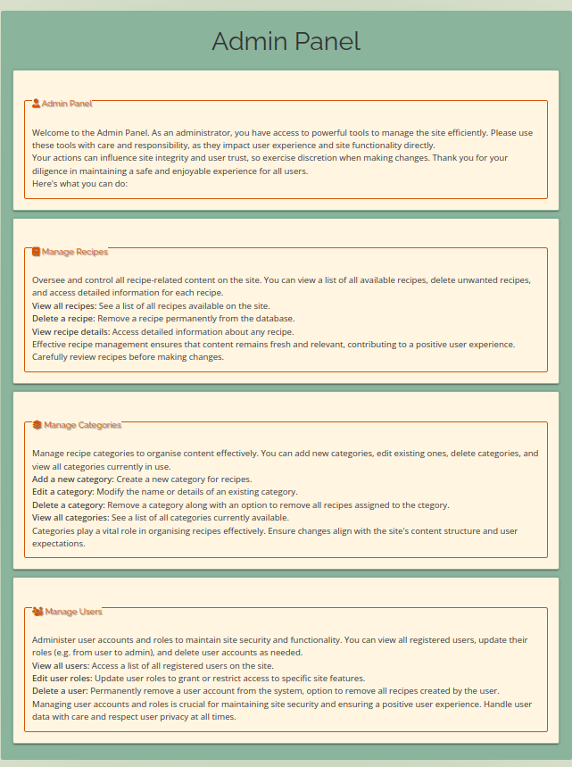

# AiryBites Recipes

## Introduction
Welcome to AiryBites Recipes, my Milestone Project 3 for the Level 5 Diploma in Full Stack Web Application Development! This project will showcase my skills in full-stack web development by creating a dynamic and user-friendly recipe sharing application.


### Project Overview
AiryBites Recipes will enable users to create, share, and discover a variety of recipes. Users will be able to:

- Sign up and log in to their accounts
- Add new recipes with details like ingredients, preparation steps, and images
- Edit and delete their own recipes
- Browse and search for recipes shared by other users
- Administrative position responsible for overseeing users, recipes, and categories through the admin panel.

## Deployed App : https://airybites-app-9649332aa316.herokuapp.com/

## List Of Features

### Navigation

- **Navigation Bar:** Provides easy access to other sections of the website with clear and responsive navigation links.
    - 
    - 

- **Side Navigation:** Provides a collapsible side navigation menu for easy access to various sections of the website.<br>
    - 

- **Admin Navigation:** Provides a navigation bar specifically tailored for administrative tasks.
    - 
### Home Page


- **Hero Image:** Features a visually appealing hero image with overlay and text, welcoming users to the site.
    - 

- **Recipe Browsing Section:**
    - **Recipe List**
        - An introductory heading encouraging users to browse recipes.
        - Recipes are displayed in a collapsible list for easy navigation.
        - Each recipe item includes a header with the recipe title, category, and options to edit or delete if created by the logged-in user.
        - 

    - **Recipe Details:**
        - Each recipe includes detailed information such as description, timers, ingredients, and instructions.
        - Additional metadata like the creator's name and timestamps are also provided.
        - 

- **Delete Confirmation Modal:**
    - A modal dialog box for confirming the deletion of a recipe.
    - 
    
### Profile Page
The Profile Page provides users with a personal space where they can view and manage their recipes. 

- **Your Profile** This section displays the user's profile information including:
    - Profile Picture: A placeholder image is shown if no profile picture is available.
    - Username: The username of the logged-in user.
    - 

- **Your Recipes**
    - This section lists all the recipes created by the user. If the user has not created any recipes yet, a prompt is shown to create or browse recipes.
    - 
- **Recipe Details Modal**
    - Each recipe has a detailed view available in a modal. This modal includes the recipe's title, description, cook time, prep time, total time, servings, ingredients, and instructions.Users can edit or delete the recipe from this modal.
    - 
- **Delete Confirmation Modal**
    - Before deleting a recipe, the user is prompted with a confirmation modal to ensure they intend to delete the recipe. This action is irreversible.
    - 


### Admin Panel Feature

- **Overview**
    - The Admin Panel is a comprehensive dashboard for site administrators to manage and maintain various aspects of the website. It provides powerful tools for overseeing recipes, categories, and user accounts. Below is a brief description of the key features available in the Admin Panel.

- **Navigation**
    - The admin navigation bar allows administrators to easily access different management sections:
    - 
        - *Manage Recipes:* Oversee and control all recipe-related content.
        - *Manage Categories:* Organise and manage recipe categories.
        - *Manage Users:* Administer user accounts and roles.

- **Admin Panel Overview**
    - A welcoming section for administrators, highlighting the importance of careful and responsible management.
    - 

- **Manage Recipes**
    - A section dedicated to overseeing all recipe-related content.
    - 

- **Manage Categories**
    - A section for managing recipe categories.
    - 

- **Manage Users**
    - A section for administering user accounts and roles.
    - 

- **Delete User Modal**
    - The Delete User Modal provides administrators with the ability to remove a user from the system. It also includes an option to delete all recipes created by the user.
    - 

### 404 Page
- **404 page** in AiryBites notifies users when a page is not found, offering clear navigation options to guide them back on track.
    - 


## UX/UI
### User Stories

#### First-Time Visitor

- As a first-time visitor, I want to browse the home page to see a variety of popular recipes, so that I can get an idea of what the app offers.
- As a first-time visitor, I want to access an introductory guide or tutorial, so that I can understand how to navigate and use the app.
- As a first-time visitor, I want to use the search functionality to find recipes that interest me, so that I can quickly locate content relevant to my preferences.

#### Returning User

- As a returning user, I want to easily log in to my account, so that I can access my saved recipes and personal settings.
- As a returning user, I want to access my saved recipes list, so that I can quickly find and use recipes I have previously bookmarked.
- As a returning user, I want to update my profile information and preferences, so that my experience is personalised and up-to-date.

#### Frequent User

- As a frequent user, I want to add new recipes to the platform, so that I can share my culinary creations with the community.
- As a frequent user, I want to comment on and rate recipes from other users, so that I can engage with the community and provide feedback.
- As a frequent user, I want to see the number of views, comments, and ratings on my submitted recipes, so that I can gauge their popularity and reception within the community.

#### Admin User

- As an admin, I want to view, edit, or delete user accounts, so that I can manage the user base effectively and ensure community guidelines are followed.
- As an admin, I want to review submitted recipes and approve or reject them, so that I can maintain the quality and appropriateness of content on the platform.
- As an admin, I want to monitor user activity, including recipe submissions, comments, and ratings, so that I can identify and address any inappropriate behaviour.
- As an admin, I want to generate reports on user engagement and content performance, so that I can analyse the platform's usage and make informed decisions for improvements.
- As an admin, I want to address user-reported issues or disputes, so that I can ensure a positive and fair experience for all users.

---

### Colour Scheme
For this app, I chose warm and inviting colour scheme which will enhance the app's appeal and usability.


#### Primary Colour: Coral (#FF6F61)

**Usage:** For primary buttons, highlights, and active elements.<br/>
**Reason:** Coral is a warm and inviting colour that grabs attention without being overwhelming. It provides a lively and energetic touch, making interactive elements stand out and encouraging user engagement.

#### Secondary Colour: Sage Green (#8AB49C)

**Usage:** For secondary buttons, accents, and backgrounds.<br/>
**Reason:** Sage Green offers a calming and natural feel, complementing the vibrancy of Coral. It creates a balanced and soothing palette, enhancing the app's overall aesthetic while providing a pleasant backdrop for content.

#### Neutral Colour: Cream (#FFF5E1)

**Usage:** For background colours, cards, and sections.<br/>
**Reason:** Cream is a soft, neutral colour that adds warmth and elegance to the app. It ensures a clean and uncluttered look, making the text and images stand out, while providing a cohesive background for various sections.

#### Accent Colour: Burnt Orange (#35400)

**Usage:** For icons, links, and smal accents.<br/>
**Reason:** Burnt Orange is a bold and earthy accent colour that adds depth and contrast. It draws attention to important elements such as icons and links, enhancing the user experience by making navigation intuitive and visually appealing.

#### Dark Colour: Charcoal (#333333)

**Usage:** For text, headers, and footers.<br/>
**Reason:** Charcoal provides excellent readability and a strong visual foundation for text. It is a versatile and sophisticated dark colour that ensures clear contrast with lighter background colours, making it ideal for headers, footers, and body text.

---

### Typography
#### Primary Font: [Raleway](https://fonts.google.com/specimen/Raleway)

*Raleway is a clean, elegant sans-serif font that offers readability and modern aesthetics.*

I chose the Raleway font for AiryBites Recipes because of its elegant and modern design, which enhances readability and gives the app a polished, professional appearance. Its versatility and range of weights ensure a cohesive and aesthetically pleasing user experience, making it ideal for headings and prominent text within the app.


#### Secondary Font: [Open Sans](https://fonts.google.com/specimen/Open+Sans)
*Open Sans is a versatile and legible sans-serif font that complements Raleway well, ensuring readability across various devices and screen sizes.*

I chose Open Sans as the secondary font for AiryBites Recipes because of its excellent readability and versatility. Its clean, neutral design complements the elegance of Raleway, ensuring that detailed recipe instructions and longer text sections are easy to read across various devices and screen sizes.


---

### MongoDB

I chose to use MongoDB for my AiryBites recipe app because its flexible, schema-less structure allows me to easily store and retrieve diverse recipe data with varying ingredients and instructions. MongoDB's document-oriented nature simplifies handling the complex, nested data typical of recipes. 
<br/>

Additionally, I decided to create an Entity-Relationship Diagram (ERD) for the database to provide a clear and visual representation of the data model. This ensures that the structure and relationships of the data are well understood and consistently implemented. The ERD also serves as valuable documentation, helps identify potential design issues early on, and offers guidance during development, keeping the database organised and scalable, ultimately enhancing the project's overall quality and maintainability.
#### ERD


**Relationships / References**
1. **Users - Recipes**<br/>
*One-to-Many*: A user can create multiple recipes (author_id in Recipes references Users._id).
2. **Users - Comments**<br/>
*One-to-Many*: A user can write multiple comments (user_id in Comments references Users._id).
3. **Users - Ratings**<br/>
*One-to-Many*: A user can rate multiple recipes (user_id in Ratings references Users._id).
4. **Recipes - Comments**<br/>
*One-to-Many*: A recipe can have multiple comments (recipe_id in Comments references Recipes._id).
5. **Recipes - Ratings**<br/>
*One-to-Many*: A recipe can have multiple ratings (recipe_id in Ratings references Recipes._id).
6. **Category - Recipe**<br/>
*One-to-Many*: A category can have multiple recipes. (category_id in Recipes references Categories._id).

#### Collections
I have set up some basic collections for MongoDB to support the functionality of the AiryBites App. These collections include user profiles, recipes, ratings, comments and categories, each structured to efficiently store and retrieve relevant data. This setup ensures the app runs smoothly and can handle user interactions effectively. I will make changes to these collections as needed to better support the app's evolving requirements.

- **Users** Stores information about the users.<br/>
*(UserID, Username, Email, Password, CreatedAt, UpdatedAt)*<br/>

- **Recipes** Stores information about the recipes, including cooking steps. References Users and Categories.<br/>
*(RecipeID, Title, Description, Ingredients[], PreparationSteps[], CookTime, Temperature, Servings, ImageURL, AuthorID, CategoryID, Tags[], CreatedAt, UpdatedAt)*<br/>

- **Comments** Stores comments on recipes. References Users and Recipes.<br/>
*(CommentID, RecipeID, UserID, Comment, CreatedAt, UpdatedAt)*<br/>

- **Ratings** Stores ratings for recipes. References Users and Recipes.<br/>
*(RatingID, RecipeID, UserID, Rating, CreatedAt, UpdatedAt)*<br/>

- **Categories** Stores information about recipe categories.<br/>
*(CategoryID, Name, Description, CreatedAt, UpdatedAt)*<br/>


### Recipe Collection

```sql
{
    "_id": {
        "$oid": "667d7bedfb3d723dcab788a0"
    },
    "recipe_title": "Recipe Title",
    "recipe_description": "Recipe Description",
    "instructions": [
        "Step 1\r",
        "Step 2\r",
        "Step 3\r"
    ],
    "cook_time": {
        "$numberInt": "60"
    },
    "prep_time": {
        "$numberInt": "60"
    },
    "total_time": {
        "$numberInt": "120"
    },
    "temperature": {
        "$numberInt": "6"
    },
    "servings": {
        "$numberInt": "6"
    },
    "image_url": "",
    "category": "Breakfast",
    "tags": [
        "Air Fryers",
        "   Potato",
        "   Wedges"
    ],
    "ingredients": [
        {
            "ingredient_id": {
                "$oid": "667d71f033ef874ed573d2fd"
            },
            "quantity": "6"
        },
        {
            "ingredient_id": {
                "$oid": "667d71f033ef874ed573d2fe"
            },
            "quantity": "1"
        }
    ],
    "created_at": {
        "$date": {
            "$numberLong": "1720552390327"
        }
    },
    "updated_at": "11/07/2024 13:30",
    "created_by": "username"
}

```

**Explanation of Fields:**
- _id: The unique identifier for the recipe, stored as an ObjectId.
- recipe_title: The title of the recipe.
- recipe_description: A brief description of the recipe.
- instructions: An array of steps to follow for the recipe.
- cook_time, prep_time, total_time: Time in minutes required for cooking preparation, and the total time respectively, stored as integers.
- temperature: The temperature setting for cooking, stored as an integer.
- servings: Number of servings the recipe yields, stored as an integer.
- image_url: A URL to an image of the recipe (for future update, at this time not possiable for user to upload image to platforms I am using.)
- category: The category under which the recipe falls (e.g., Breakfast).
- tags: An array of tags associated with the recipe.
- ingredients: An array of ingredients used in the recipe, each containing an ingredient_id (ObjectId) and a quantity.
- created_at: The timestamp when the recipe was created, stored as a date object with a long integer value.
- updated_at: The date and time when the recipe was last updated.
- created_by: The user who created the recipe.

---

### Wireframes

I have designed the wireframe for PC and mobile screens for the AiryBites App to ensure a seamless user experience across all devices. The layout is intuitive, featuring easy navigation and clear categorisation of recipes. The design includes a search function, detailed recipe views, user profiles, and a straightforward upload process for user-submitted recipes. This approach ensures users can effortlessly find, save, and add ingrediants to shopping list of their favourite air fryer recipes, whether they are using a desktop or a mobile device.

#### Home Page


#### Search Results Page


#### Category Page


#### Recipe Detail Page


#### User Profile Page


---

## Testing
The app's functionality was also tested by friends and family. Their feedback was invaluable in identifying any issues and making necessary improvements.

For a detailed list of all testing steps taken, please refer to [TESTING.md](documentation/TESTING.md)

---

## Deployment
The deployment process involved several steps to ensure that the app was correctly and efficiently deployed to production environments.

**Platform Deployment**
- App Deployment: The app was deployed to Heroku, a cloud platform that allows for easy and scalable application hosting. More information about Heroku can be found [here](https://www.heroku.com/).
- Database Deployment: The database was deployed using MongoDB, a NoSQL database known for its flexibility and scalability. More information about MongoDB can be found [here](https://www.mongodb.com/).

For full deployment steps, please refer to [DEPLOYMENT.md](documentation/DEPLOYMENT.md)

## Future Improvements to the AiryBites App
To enhance the user experience and functionality of the AiryBites app, I have identified several key improvements. Below is a list of these enhancements, along with reasons why some may face implementation delays due to time constraints and the current use of GitHub.

### Planned Improvements
- Advanced Search Functionality
   - Description: Allow users to filter recipes by ingredients, category, tags, and cooking time.
   - Reason for Delay: Complex filtering algorithms and data structuring required. Significant development time needed.

- Saved Recipes Access
   - Description: Enable users to comment on and rate recipes to foster community engagement.
   - Reason for Delay: Implementation of a robust moderation system to manage comments and ratings will be time-consuming.

- Recipe Analytics for Users
   - Description: Show detailed analytics on views, comments, and ratings for each user's submitted recipes.
   - Reason for Delay: Integration of analytics tools and data visualisation components can be complex and time-intensive.

- Admin Monitoring Tools
   - Description: Enhance tools for admins to monitor user activity, including recipe submissions, comments, and ratings.
   - Reason for Delay: Developing comprehensive monitoring dashboards and alerts will require extensive backend work.

- User Engagement and Performance Reports
   - Description: Generate detailed reports on user engagement and content performance for admins.
   - Reason for Delay: Creating dynamic reporting systems with customisable metrics will involve significant development efforts.

**Conclusion**
While I aim to implement these improvements to enhance the AiryBites app, some features may experience delays due to the complexity and development time required. However, I am committed to continuously improving the app and will prioritise features based on user feedback and resource availability.


## Tools and Technologies Used

- **MongoDB:** This database offers a flexible and scalable storage solution for our recipe data.

- **Backend:**
    - Flask: A web framework that manages server-side logic and ensures smooth interactions between the frontend and backend.
    - Python: The primary programming language for backend logic and various functionalities of the application.
    - Jinja2: The templating engine used by Flask to render HTML templates dynamically based on the backend data.

- **Frontend:**
    - JavaScript: Enhances the interactivity and responsiveness of the user interface.
    - HTML: Structures the web pages and displays content effectively.
    - CSS: Styles the application to ensure a visually appealing and consistent design.
    - Materialize: A modern, responsive CSS framework based on Material Design, providing a sleek and professional look to the UI components.
    - jQuery: Simplifies JavaScript programming and enhances functionality with its extensive library.
    - FontAwesome: Provides scalable vector icons that can be customised with CSS.
    - Google Fonts: Offers a wide selection of fonts to enhance typography and design.

- **Deployment and Version Control:**
    - Heroku: A platform for deploying, managing, and scaling the application.
    - GitHub: For version control, collaboration, and hosting the source code.

### Other Tools 

- [Birme.net](https://brime.net) used to resize images. 
- [GIMP](https://www.gimp.org/) was used to resize images for the README, TESTING and DEVELOPMENT files. 
- [Real Favicon Generator](https://realfavicongenerator.net/) was used to generate favicons for the app.
- [Colors.co](https://coolors.co/) was used to create the colour scheme for the app.
- [Balsamiq](https://balsamiq.com/) aided in creating wireframes for the app.  
- [Lighthouse](https://developer.chrome.com/docs/lighthouse/overview) was used to check the performance.
- [GoFullPage](https://gofullpage.com/) was used to get full page images.
- [W3C HTML Validator](https://validator.w3.org/) was used to validate HTML documents.
- [Jigsaw W3 CSS Validator](https://jigsaw.w3.org/) was used to validate CSS documents.
- [Peek](https://github.com/phw/peek) was used for animated gif recordings.
- [Responsive Viewer](https://chromewebstore.google.com/detail/responsive-viewer/inmopeiepgfljkpkidclfgbgbmfcennb) was continuously used to test multiple screens while developing.
- [WAVE Web Accessibility Evaluation Tools](https://wave.webaim.org/) was used to check Web Accessibility.

## Credits

### Background Images
Images provided by [PNGTree](https://pngtree.com/).

### Favicon: 
Favicon made on [Favicon Generator](https://favicon.io/favicon-generator/)
### Research Websites
- [W3C School](https://www.w3schools.com/js/) to read and learn how to use JS.
- [Mozilla Developer](https://developer.mozilla.org/en-US/docs/Learn/JavaScript) Learn JavaScript.
- **MongoDB**: Learn more about MongoDB at the [MongoDB Documentation](https://docs.mongodb.com/).
- **Python**: Explore Python's capabilities and syntax at [Python Documentation](https://docs.python.org/).
- **Jinja2**: Discover Jinja2 templating engine at [Jinja Documentation](https://jinja.palletsprojects.com/).

---
---

## Acknowledgments

- [Juliia Konovalova](https://github.com/IuliiaKonovalova) Thank you for your awesome guidance throughout this project.
- [Code Institute](https://codeinstitute.net) Slack community and members for their help and support.
- [Kevin Powell](https://www.youtube.com/channel/UCJZv4d5rbIKd4QHMPkcABCw) for his CSS tutorials.
- [Online Tutorials](https://www.youtube.com/@OnlineTutorialsYT) for tutorial on CSS Animation.
- [Super Simple Dev](https://youtu.be/SBmSRK3feww?si=oJoi7n9oJxI8Dgya) JavaScript tutorial.

---
---

## Mistakes and personal goals for improvements 

I am aware my commits are not up to standards for good practices. I have tried to use the commits in the style listed below and I am also aware that at times I have made mistakes with my commit messages. 

*I have been using commit types like shown below to improve my commit messages:*

- feat – a new feature is introduced with the changes. 

- fix – a bug fix has occurred.

- chore – changes that do not relate to a fix or feature and do not modify source or test files (for example updating dependencies).

- refactor – refactored code that neither fixes a bug nor adds a feature.

- docs – updates to documentation such as the README or other markdown files. 
