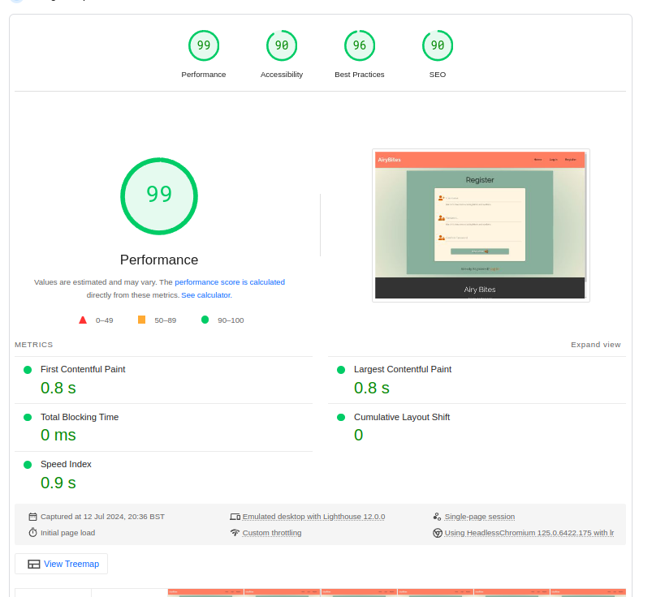

# Testing

## Deployed App : https://airybites-app-9649332aa316.herokuapp.com/

## BETA Testers 

The BETA testers, consisting of friends and family, enthusiastically engaged in testing the AiryBites Air Fryers recipe app. They assumed various roles and used a variety of devices, from home chefs exploring new recipes to tech-savvy testers navigating administrative functions. Their diverse perspectives and feedback were instrumental in refining the app's usability and functionality across smartphones, tablets, and laptops. A heartfelt thank you is extended to everyone who participated, ensuring that AiryBites meets the needs of its users! Special appreciation goes to my 8-year-old son and 10-year-old daughter for adding some truly "Yummy!" recipes to the mix.

## Browser Compatibility Tests
I tested the website in different browsers for compatibility.

- Chrome Browser Test
    - 

- Firefox Browser Test
    - 

- Opera Browser Test
    - 


## W3Schools NU Validator

### CSS
- Style
    - 

### HTML
- Home Page
    - 

- Login Page
    - 

- Profile Page
    - 

- Admin Panel Page
    - 

- Manage Recipes Page from Admin Panel
    - 


### Code Institutes Python Linter

- Used CI Python Lint to check that the code is PEP8 compliant. 


### JShint

- Use of Jshint to check the script.js file.


The JSHint validator checker reported two undefined variables:
- `$` at lines 4, 6, 8, 10, 12, 63, 64, 67, 68, 69, 70, 74, 75, 77, 78, 79, 80
- `$`: This error is due to the use of jQuery, which uses $ as a shorthand for its operations.

- `M` at lines 95, 108, 116, 118, 126
- `M`: This error is due to the use of modal functions or other Materialize components used.

## Lighthouse

I could not check all pages due to user authentication, which caused the Lighthouse extension to redirect to the login page. I have only taken the tests on the pages that are accessible without user authentication.

- Home Page
    - 

- Login Page
    - 

- Registration Page
    - 

## Manual Testing

### Base Template base.html

| Element               | Location         | Expected Behaviour                              | Tested | Passed | Comments                                     |
|-----------------------|------------------|-------------------------------------------------|--------|--------|----------------------------------------------|
| Home (Desktop)        | Top Navbar       | Navigates to the home page                      | Yes    | Yes    |                                              |
| Profile (Desktop)     | Top Navbar       | Navigates to the user's profile page            | Yes    | Yes    | Visible only when logged in                  |
| New Recipe (Desktop)  | Top Navbar       | Opens the new recipe form                       | Yes    | Yes    | Visible only when logged in                  |
| Admin (Desktop)       | Top Navbar       | Navigates to the admin panel                    | Yes    | Yes    | Visible only when user has admin role        |
| Log Out (Desktop)     | Top Navbar       | Logs the user out and redirects to the home page| Yes    | Yes    | Visible only when logged in                  |
| Log in (Desktop)      | Top Navbar       | Navigates to the login page                     | Yes    | Yes    | Visible only when not logged in              |
| Register (Desktop)    | Top Navbar       | Navigates to the registration page              | Yes    | Yes    | Visible only when not logged in              |
| Menu (Mobile)         | Mobile Navbar    | Opens the mobile navigation menu                | Yes    | Yes    |                                              |
| Home (Mobile)         | Mobile Navbar    | Navigates to the home page                      | Yes    | Yes    |                                              |
| Profile (Mobile)      | Mobile Navbar    | Navigates to the user's profile page            | Yes    | Yes    | Visible only when logged in                  |
| New Recipe (Mobile)   | Mobile Navbar    | Opens the new recipe form                       | Yes    | Yes    | Visible only when logged in                  |
| Admin (Mobile)        | Mobile Navbar    | Navigates to the admin panel                    | Yes    | Yes    | Visible only when user has admin role        |
| Log Out (Mobile)      | Mobile Navbar    | Logs the user out and redirects to the home page| Yes    | Yes    | Visible only when logged in                  |
| Log in (Mobile)       | Mobile Navbar    | Navigates to the login page                     | Yes    | Yes    | Visible only when not logged in              |
| Register (Mobile)     | Mobile Navbar    | Navigates to the registration page              | Yes    | Yes    | Visible only when not logged in              |
| Flash Message (Error) | Main Section     | Displays a red error message                    | Yes    | Yes    |                                              |
| Flash Message (Success)| Main Section    | Displays a green success message                | Yes    | Yes    |                                              |
| Flash Message (Warning)| Main Section    | Displays an orange warning message              | Yes    | Yes    |                                              |
| Footer Home           | Footer           | Navigates to the home page                      | Yes    | Yes    |                                              |

### Home Page index.html

| Element               | Location         | Expected Behaviour                              | Tested | Passed | Comments                                     |
|-----------------------|------------------|-------------------------------------------------|--------|--------|----------------------------------------------|
| Hero Image            | Top of the page  | Displays hero image with overlay and text       | Yes    | Yes    |                                              |
| Browse Recipes Header | Below Hero Image | Displays "Browse Recipes" header                | Yes    | Yes    |                                              |
| Collapsible Recipes   | Main Content     | Lists recipes in collapsible headers            | Yes    | Yes    |                                              |
| Recipe Title          | Collapsible Header | Displays the title of the recipe                | Yes    | Yes    |                                              |
| Recipe Category       | Collapsible Header | Displays the category of the recipe             | Yes    | Yes    |                                              |
| Edit Button           | Collapsible Header | Opens the edit recipe page                      | Yes    | Yes    | Visible only when logged in user created the recipe |
| Delete Button         | Collapsible Header | Opens delete confirmation modal                 | Yes    | Yes    | Visible only when logged in user created the recipe |
| Description Section   | Collapsible Body | Displays the recipe description                 | Yes    | Yes    |                                              |
| Timers Section        | Collapsible Body | Displays cook, prep, total time and servings    | Yes    | Yes    |                                              |
| Ingredients Section   | Collapsible Body | Lists ingredients with quantity                 | Yes    | Yes    |                                              |
| Instructions Section  | Collapsible Body | Lists step-by-step instructions                 | Yes    | Yes    |                                              |
| Created By            | Collapsible Body | Displays the creator of the recipe              | Yes    | Yes    |                                              |
| Posted On             | Collapsible Body | Displays the date the recipe was posted         | Yes    | Yes    |                                              |
| Updated On            | Collapsible Body | Displays the date the recipe was last updated   | Yes    | Yes    |                                              |
| Delete Confirmation Modal | Modal       | Asks for confirmation to delete the recipe      | Yes    | Yes    |                                              |
| Delete Button (Modal) | Modal            | Deletes the recipe and closes the modal         | Yes    | Yes    |                                              |
| Cancel Button (Modal) | Modal            | Closes the modal without deleting the recipe    | Yes    | Yes    |                                              |


###  Add Recipe Page add_recipe.html

| Element                | Location             | Expected Behaviour                                      | Tested | Passed | Comments                                    |
|------------------------|----------------------|---------------------------------------------------------|--------|--------|---------------------------------------------|
| Page Title             | Title Block          | Displays "Add Recipe Page" as the page title            | Yes    | Yes    |                                             |
| Page Header            | Main Container       | Displays "Add Recipe" header                            | Yes    | Yes    |                                             |
| Category Selection     | Form                 | Allows user to select a recipe category                 | Yes    | Yes    | Dropdown with categories populated          |
| Recipe Title Input     | Form                 | Allows user to enter a recipe title                     | Yes    | Yes    |                                             |
| Recipe Description Input| Form                | Allows user to enter a recipe description               | Yes    | Yes    |                                             |
| Cook Time Input        | Timers Section       | Allows user to enter cook time in minutes               | Yes    | Yes    |                                             |
| Prep Time Input        | Timers Section       | Allows user to enter prep time in minutes               | Yes    | Yes    |                                             |
| Temperature Input      | Timers Section       | Allows user to enter cooking temperature in Celsius     | Yes    | Yes    |                                             |
| Servings Input         | Timers Section       | Allows user to enter number of servings                 | Yes    | Yes    |                                             |
| Ingredients Section    | Ingredients Section  | Allows user to add and remove ingredients               | Yes    | Yes    |                                             |
| Add Ingredient Button  | Ingredients Section  | Adds new ingredient input fields                        | Yes    | Yes    |                                             |
| Remove Ingredient Button | Ingredients Section | Removes ingredient input fields                         | Yes    | Yes    |                                             |
| Instructions Input     | Instructions Section | Allows user to enter step-by-step instructions          | Yes    | Yes    |                                             |
| Tags Input             | Form                 | Allows user to enter tags, comma-separated              | Yes    | Yes    |                                             |
| Submit Button          | Form                 | Submits the form to add a new recipe                    | Yes    | Yes    |                                             |

### Admin Panel Page
Only visiable 

| Element                          | Location                | Expected Behaviour                                          | Tested | Passed | Comments                                        |
|----------------------------------|-------------------------|-------------------------------------------------------------|--------|--------|-------------------------------------------------|
| Admin Role Access                | Admin Panel Page        | Only accessible by users with an admin role                 | Yes    | Yes    |                                                 |
| Page Title                       | Title Block             | Displays "Admin Panel Page" as the page title               | Yes    | Yes    |                                                 |
| Admin Navigation Menu            | Navigation Block        | Displays links to manage recipes, categories, and users     | Yes    | Yes    |                                                 |
| Admin Panel Header               | Main Container          | Displays "Admin Panel" header                               | Yes    | Yes    |                                                 |
| Admin Panel Information Section  | Admin Content Block     | Displays admin panel information                            | Yes    | Yes    |                                                 |
| Manage Recipes Link              | Admin Content Block     | Links to the "Manage Recipes" page                          | Yes    | Yes    |                                                 |
| Manage Categories Link           | Admin Content Block     | Links to the "Manage Categories" page                       | Yes    | Yes    |                                                 |
| Manage Users Link                | Admin Content Block     | Links to the "Manage Users" page                            | Yes    | Yes    |                                                 |
| Manage Recipes Section           | Admin Content Block     | Displays information and actions related to managing recipes| Yes    | Yes    |                                                 |
| Manage Categories Section        | Admin Content Block     | Displays information and actions related to managing categories | Yes    | Yes    |                                             |
| Manage Users Section             | Admin Content Block     | Displays information and actions related to managing users  | Yes    | Yes    |                                                 |


### Manage Catergories page Admin Only

| Element                          | Location                   | Expected Behaviour                                                                                   | Tested | Passed | Comments             |
|----------------------------------|----------------------------|------------------------------------------------------------------------------------------------------|--------|--------|----------------------|
| Page Title                       | Browser Tab                | Displays "Manage Categories" as the page title.                                                        | Yes    | Yes    |                      |
| Navigation Links                 | Top Navigation Bar         | Navigation links are visible and accessible only to admin roles.                                       | Yes    | Yes    |                      |
| Manage Categories Description    | Top of Page                | Presents a description of the manage categories section and a warning about category management.      | Yes    | Yes    |                      |
| Add New Category Button          | Top of Page                | Initiates a modal to add a new category upon clicking.                                                 | Yes    | Yes    |                      |
| Categories Table                 | Middle of Page             | Displays a table listing all categories, including category name, number of recipes, and action buttons.| Yes  | Yes    |                      |
| Edit Button                      | Categories Table - Actions | Opens a modal for editing the selected category upon clicking.                                         | Yes    | Yes    |                      |
| Modal Open - Add New Category     | "Add New Category" Button  | Clicking "Add New Category" button opens the modal for adding a new category.                        | Yes    | Yes    |                      |
| Modal Close - Add New Category    | Add New Category Modal     | Clicking "Close" in the Add New Category modal closes the modal without adding a category.           | Yes    | Yes    |                      |
| Add New Category Form Submission | Add New Category Modal     | Submitting the form in the Add New Category modal successfully adds a new category to the list.       | Yes    | Yes    |                      |
| Modal Open - Edit Category       | "Edit" Button in Table     | Clicking "Edit" button for a category opens the modal to edit that category's name.                   | Yes    | Yes    |                      |
| Modal Close - Edit Category      | Edit Category Modal        | Clicking "Close" in the Edit Category modal closes the modal without making changes.                  | Yes    | Yes    |                      |
| Edit Category Form Submission    | Edit Category Modal        | Submitting the form in the Edit Category modal successfully updates the category name.                | Yes    | Yes    |                      |
| Modal Open - Delete Category     | "Delete" Button in Table   | Clicking "Delete" button for a category opens the modal to confirm deletion.                          | Yes    | Yes    |                      |
| Modal Close - Delete Category    | Delete Category Modal      | Clicking "Cancel" in the Delete Category modal closes the modal without deleting the category.        | Yes    | Yes    |                      |
| Delete Category Confirmation    | Delete Category Modal      | Clicking "Delete" in the Delete Category modal permanently deletes the category from the list.        | Yes    | Yes    |                      |
| Categories Table Sorting        | Table Headers              | Clicking on "Category Name" or "Number of Recipes" headers sorts the table alphabetically or numerically.| Yes | Yes    |                      |
| Error Handling - Add Category    | Add New Category Form      | Submitting the form without entering a category name displays an error message and prevents submission.| Yes    | Yes    |                      |
| Error Handling - Edit Category   | Edit Category Form         | Submitting the form without entering a category name displays an error message and prevents submission.| Yes    | Yes    |                      |
| Error Handling - Delete Category | Delete Category Modal      | Confirming deletion without selection displays an error message and prevents deletion.                | Yes    | Yes    |                      |

### User Management Page - Admin Only

| Element                                | Location                   | Expected Behaviour                                                                                   | Tested | Passed | Comments             |
|----------------------------------------|----------------------------|------------------------------------------------------------------------------------------------------|--------|--------|----------------------|
| Role Selection - Dropdown              | Role Selection Dropdown    | Dropdown displays correct roles ("User" and "Admin").                                                | Yes    | Yes    |                      |
| Role Selection - Default Value         | Role Selection Dropdown    | Default role for each user is correctly displayed and selectable.                                    | Yes    | Yes    |                      |
| Role Update Form Submission            | Update Role Button         | Selecting a different role and clicking "Update Role" successfully updates the user's role.          | Yes    | Yes    |                      |
| Role Update - Server Response          | Update Role Button         | Submitting the form updates the role in the database and shows a success message.                    | Yes    | Yes    |                      |
| Role Update - Invalid Data             | Update Role Button         | Submitting the form with invalid data displays an error message.                                       | Yes    | Yes    |                      |
| Delete User Modal Display              | "Delete User" Button       | Clicking "Delete User" button displays the delete user confirmation modal.                           | Yes    | Yes    |                      |
| Delete User Modal Close                | Delete User Modal          | Clicking "Cancel" in the delete user modal closes the modal without deleting the user.               | Yes    | Yes    |                      |
| Delete User Confirmation               | Delete User Modal          | Clicking "Delete" in the delete user modal triggers the user deletion process.                       | Yes    | Yes    |                      |
| Delete Recipes Checkbox Display        | Delete User Modal          | Delete user modal includes a checkbox to delete all recipes created by the user.                     | Yes    | Yes    |                      |
| Delete Recipes Checkbox Selection       | Delete User Modal          | Checking the "Also delete all recipes created by this user" checkbox updates the form submission to include recipe deletion. | Yes | Yes |                      |
| Error Handling - Role Update           | Update Role Button         | Submitting the role update form without selecting a role displays an error and prevents submission.  | Yes    | Yes    |                      |
| Error Handling - Delete User           | Delete User Modal          | Confirming deletion without selecting the checkbox displays an error message and prevents deletion.   | Yes    | Yes    |                      |
| User List Display                      | User List Table            | All users are displayed with correct usernames and roles.                                            | Yes    | Yes    |                      |
| User List Pagination                   | User List Table            | Pagination works correctly, displaying users in pages.                                                | Yes    | Yes    |                      |
| User List Sorting                      | User List Table            | Users can be sorted by username and role.                                                           | Yes    | Yes    |                      |
| User Role Update - Success Message     | Update Role Button         | Successfully updating a role shows a confirmation message.                                           | Yes    | Yes    |                      |
| User Role Update - Error Message       | Update Role Button         | Updating a role with invalid data shows an error message.                                            | Yes    | Yes    |                      |
| User Deletion - Confirmation Dialog    | Delete User Button        | Clicking "Delete User" opens a confirmation dialog.                                                  | Yes    | Yes    |                      |
| User Deletion - Recipe Deletion Option | Delete User Modal          | Checkbox "Also delete all recipes created by this user" is functional and updates the deletion process. | Yes | Yes |                      |
| Role Selection - Accessible Options    | Role Dropdown             | The role dropdown correctly displays the options for "User" and "Admin" only.                         | Yes    | Yes    |                      |
| User List Search Functionality         | User List Table            | Searching for a username filters the list to show matching results.                                  | Yes    | Yes    |                      |
| User List Filter by Role               | User List Table            | Filtering users by role displays only users with the selected role.                                   | Yes    | Yes    |                      |
| User List - No Users Message           | User List Table            | Displays a message if there are no users to show.                                                    | Yes    | Yes    |                      |
| User List - Error Handling             | User List Table            | Displays an error message if user data cannot be loaded.                                             | Yes    | Yes    |                      |


## Bugs

### Solved Bugs

**Bug Report**

Blank lines appearing in the instructions list of recipes.

- Description
    - When viewing a recipe, the instructions list was displaying blank lines at steps. This occurred because some instructions contained only whitespace, which was rendered as blank list items.

- Steps to Reproduce
    1. Navigate to a recipe page.
    2. View the instructions list.
    3. Observe the presence of blank lines within the list of instructions.

- Expected Behaviour
    - The instructions list should only display steps that contain actual instructions, with no blank lines.

- Actual Behaviour
    - The instructions list includes blank lines for steps that contain only whitespace.

- Original Code
    - The instructions list was displaying blank lines at steps when the recipe was viewed.

```

    <li>{{ instruction }}</li>

```
- Solution
To fix this issue, I added a strip() method to remove any leading or trailing whitespace from each instruction before rendering it.

- Fixed Code
```

    
        <li>{{ instruction }}</li>
    

```
- Summary
    - By adding the strip() method, blank lines are no longer rendered in the instructions list, ensuring that only steps with actual content are displayed.


### Unsolved bugs

- None known
